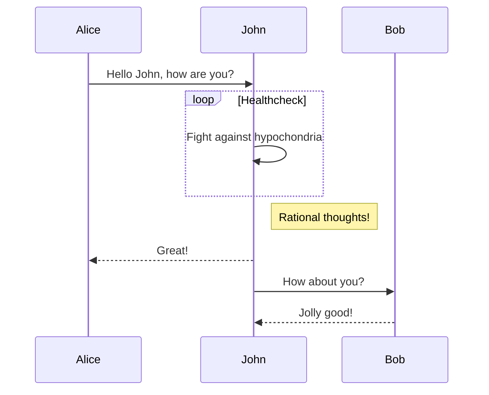
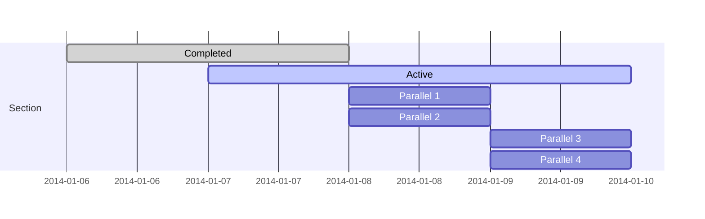
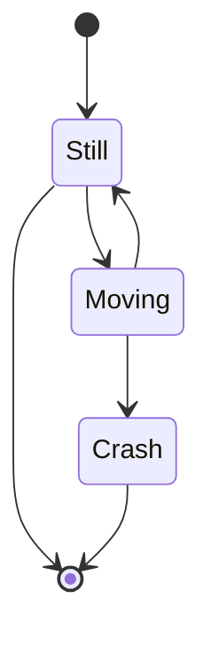
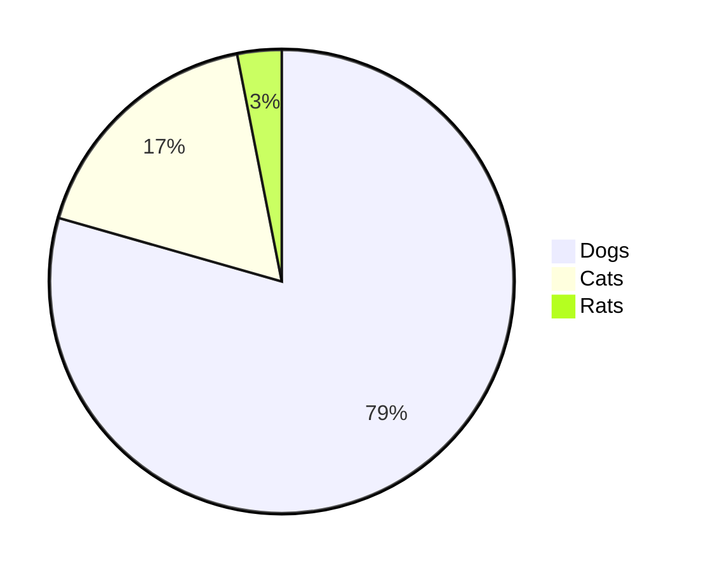
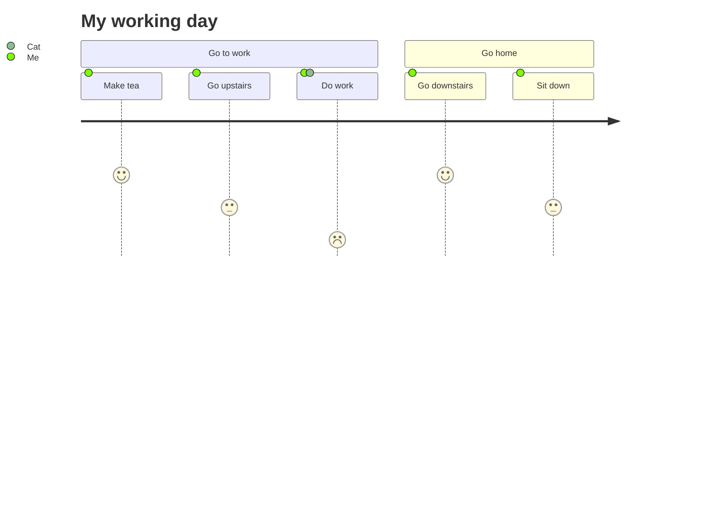

# 主题样式演示 - 基础功能

本文档用于测试 Redefine 主题的基础功能和样式渲染。

## 🔢 数学公式测试

### 行内公式
这是一段文本 $ i\hbar\frac{\partial}{\partial t}\psi=-\frac{\hbar^2}{2m}\nabla^2\psi+V\psi $

行内公式，$ formula $ 行内公式，$ formula $ 行内公式，$ x = y $ 行内公式，$ x = y $ and $ i\hbar\frac{\partial}{\partial t}\psi=-\frac{\hbar^2}{2m}\nabla^2\psi+V\psi $ and $ i\hbar\frac{\partial}{\partial t}\psi=-\frac{\hbar^2}{2m}\nabla^2\psi+V\psi $

### 块级公式
$$
i\hbar\frac{\partial}{\partial t} \psi=-\frac{\hbar^2}{2m}\nabla^2\psi+V\psi
$$

$$
\int |K(x,y)f(y)| d \nu(y) \leqslant \left[ \int |K(x,y)|d \nu(y) \right]^{1 / q} \left[ \int |K(x,y)| |f(y)|^p \right]^{1 / p} \leqslant C^{1 / q} \left[ \int |K(x,y)| |f(y)|^p d \nu(y) \right]^{1 / p}\text{ i.e } \int \left[ \int |K(x,y)f(y)| d \nu(y) \right]^p d \mu(x) \leqslant C^{p / q} \iint |K(x,y)| |f(y)|^p d \nu(y) d \mu(x).
$$

## 📝 文本格式测试

### 标题层级
# H1 标题

## H2 标题

### H3 标题

#### H4标题

##### H5 标题

###### H6 标题

### 列表格式
1. 有序列表项1
2. 有序列表项2
    - 无序子列表
    - 无序子列表
    - 无序子列表

2. 有序列表项3
    - 无序子列表
    - 无序子列表
    - 无序子列表

### 任务列表
- [x] 已完成的任务
- [ ] 未完成的任务
- [ ] 另一个未完成的任务

### 文本样式
**加粗**

_斜体_

~~删除线~~

### 代码格式
`行内代码`

```
代码块
```

```python
print("代码高亮")
```

## 🖼️ 图片和链接测试

### 外部图片


### 图片链接
[](https://vkszgvyrd934rzji.public.blob.vercel-storage.com/img/2024/1/CleanShot_2024-01-16_at_23.11.09_2x-sqzy8.jpeg)

[](https://storage.ohevan.com/img/2024/1/CleanShot_2024-01-16_at_23.11.09_2x-sqzy8.jpeg)

## 🎨 图标字体测试

### Font Awesome 图标样式
**Solid:** <i class="fa-solid fa-house"></i> <i class="fa-solid fa-envelope"></i> <i class="fa-solid fa-camera-retro"></i> <i class="fa-solid fa-cart-shopping"></i>

**Regular:** <i class="fa-regular fa-house"></i> <i class="fa-regular fa-envelope"></i> <i class="fa-regular fa-camera-retro"></i> <i class="fa-regular fa-cart-shopping"></i>

**Light:** <i class="fa-light fa-house"></i> <i class="fa-light fa-envelope"></i> <i class="fa-light fa-camera-retro"></i> <i class="fa-light fa-cart-shopping"></i>

**Thin:** <i class="fa-thin fa-house"></i> <i class="fa-thin fa-envelope"></i> <i class="fa-thin fa-camera-retro"></i> <i class="fa-thin fa-cart-shopping"></i>

**Duotone:** <i class="fa-duotone fa-house"></i> <i class="fa-duotone fa-envelope"></i> <i class="fa-duotone fa-envelope"></i> <i class="fa-duotone fa-camera-retro"></i> <i class="fa-duotone fa-cart-shopping"></i>

**Sharp Solid:** <i class="fa-sharp fa-solid fa-house"></i> <i class="fa-sharp fa-solid fa-envelope"></i> <i class="fa-sharp fa-solid fa-camera-retro"></i> <i class="fa-sharp fa-solid fa-cart-shopping"></i>

## 📋 表格测试

| Column 1 | Column 2 | Column 3 | Column 4 |
|----------|----------|----------|----------|
| Row 1    | Data A   | Value X  | 100      |
| Row 2    | Data B   | Value Y  | 200      |
| Row 3    | Data C   | Value Z  | 300      |
| Row 4    | Data D   | Value W  | 400      |

## 🔔 提示块测试


这是一个自定义标题的红色提示块，用于测试主题的提示块功能。


## 🔧 代码语法高亮测试

### 汇编语言代码
```x86asm
mov    rsp, cr3
and    rsp, 0xffffffffffffe7ff
mov    cr3, rsp
```

## 📊 图表和流程图测试

### 序列图 (Sequence Diagram)


### 甘特图 (Gantt Chart)


### 状态图 (State Diagram)


### 饼图 (Pie Chart)


### 用户旅程图 (User Journey)


## 🔄 差异比较测试

### Git Diff 样式
```diff
- const oldFunction = () => {
-   console.log("This will be removed");
+ const newFunction = () => {
+   console.log("This is a new line");
    console.log("This line stays the same");
-   return false;
+   return true;
}
```

## 📝 其他功能测试

### 长文本和特殊字符
In this version, window.walineInitialized is used as a flag to ensure that the Waline initialization happens only once per page load, preventing redundant initializations during Swup navigations or repeated DOMContentLoaded events. This approach should mitigate the concerns about the script executing multiple times in an SPA context.

### 编号列表与双亲委派模型破坏情况
1. 第一种被破坏的情况是在双亲委派出现之前。
   由于双亲委派模型是在 JDK1.2 之后才被引入的，而在这之前已经有用户自定义类加载器在用了。所以，这些是没有遵守双亲委派原则的。
2. 第二种，是 JNDI、JDBC 等需要加载 SPI 接口实现类的情况。
3. 第三种是为了实现热插拔热部署工具。
   为了让代码动态生效而无需重启，实现方式时把模块连同类加载器一起换掉就实现了代码的热替换。
```
